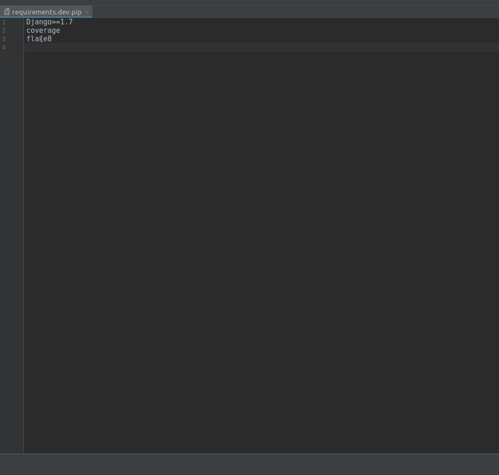

# pip-req-bubble
Simple Pycharm plugin which provides info bubble for python requirements.
This plugin helps to quickly know information about chosen python library in requirements file

[Go to the plugin page](https://plugins.jetbrains.com/plugin/10506-info-bubble-for-python-requirements)

